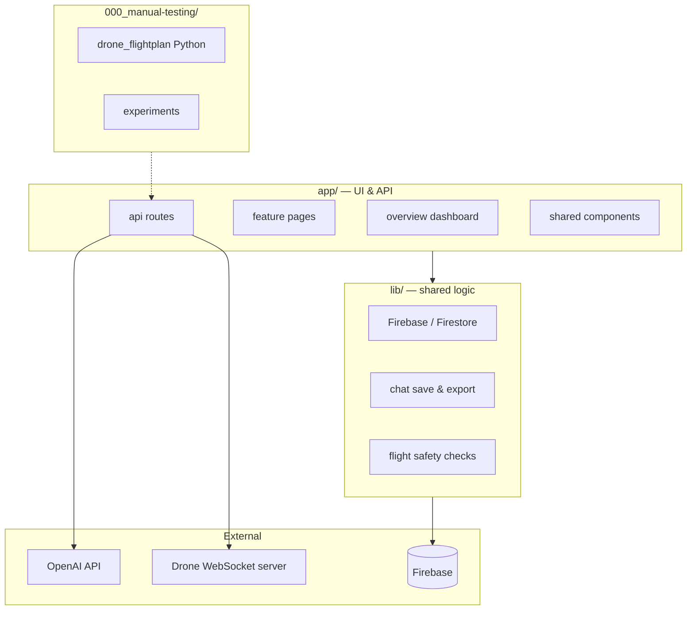

# VED-SCOUT — Project mental graph

**VED-SCOUT** = *Voice Enabled autonomous Drone weed Scouting*

A Next.js web app for managing agricultural drone missions: plots, cameras, mission types, voice/AI flight planning, and live WebSocket control to a drone (Soysan). Data lives in **Firebase/Firestore**. The AI assistant uses **OpenAI** with server-side tools.



---

## Root (`/`)

| Path | What it is |
|------|------------|
| `README.md` | Default Next.js getting-started docs |
| `package.json` | Dependencies: Next 16, React 19, Firebase, Leaflet, Vercel AI SDK, xlsx |
| `next.config.ts` | Next.js configuration |
| `tsconfig.json` | TypeScript config |
| `eslint.config.mjs` | ESLint rules |
| `postcss.config.mjs` | PostCSS / Tailwind pipeline |
| `.nvmrc` | Node version pin (≥20) |
| `webscoket-for-soysan.py` | **Production-style** Python WebSocket server on the drone host — receives flight commands and runs onboard DJI SDK binaries |
| `websocket-for-soysan-logging.py` | **Test/logging** WebSocket server — acknowledges missions and runs safety checks but does **not** execute flight binaries |
| `pnpm-lock.yaml` / `package-lock.json` | Lockfiles (project uses pnpm) |

---

## `app/` — Next.js App Router (UI + API)

Entry point: `page.tsx` redirects `/` → `/overview`.  
Root shell: `layout.tsx` (sidebar, dark theme, global providers).  
Styles: `globals.css`.

### `app/overview/` — Main dashboard

The primary landing page. A draggable grid of widgets plus a floating voice recorder.

| Path | Description |
|------|-------------|
| `page.tsx` | Composes the dashboard grid and voice UI |
| `mapOverviewFocusContext.tsx` | Context for syncing map focus when a plot is selected elsewhere |
| **`widgets/`** | |
| `mapOverview.tsx` | Leaflet map showing all plots |
| `mapRenderer.tsx` | Low-level map rendering helpers |
| `yourPlots.tsx` | List/manage agricultural field plots (corners, names) |
| `missionTypes.tsx` | Mission type configs (mapping, DSM, image point, video) |
| `cameraSensors.tsx` | Camera sensor specs (focal length, sensor size, resolution) |
| `flightHistory.tsx` | Past flight records |
| `voiceRecorder.tsx` | Mic UI — sends audio to transcribe + flight-assistant |
| `addPlotModal.tsx` / `editPlotModal.tsx` | Modals for creating/editing plots |
| `addMissionModal.tsx` | Modal for new mission types |
| `addCameraModal.tsx` | Modal for new camera sensors |

### Feature pages (sidebar routes)

| Path | Description |
|------|-------------|
| `your-plots/` | Full-page plots view: map + plot list (reuses overview widgets) |
| `camera-sensors/` | Dedicated camera sensors management page |
| `mission-types/` | Dedicated mission types page |
| `flight-history/` | Dedicated flight history page |
| `flight-script/` | Text/voice chat UI for planning and executing missions via the AI assistant; shows tool calls, WebSocket status, export to Excel |
| `flight-script/saveFlightScriptChatContent.tsx` | Save-chat modal content for flight-script conversations |
| `saved-chats/` | Browse, load, delete, and sync saved flight-script chats (local + Firebase) |
| `live-missions/` | Live drone telemetry: WebSocket connect, map, console |
| `live-missions/liveMissionMap.tsx` | Map for live mission tracking |
| `live-missions/telemetryConsole.tsx` | Scrollable telemetry log |
| `live-missions/useWebSocketTelemetry.ts` | Hook for parsing live WS telemetry messages |
| `websocket-connect/` | Simple page to connect/disconnect the global WebSocket |
| `dev-ws-chat/` | Developer sandbox: full AI chat + WS flight execution with detailed timing/safety logging |
| `voice-command/` | Placeholder page (voice is driven from overview sidebar mic) |

### `app/components/` — Shared React UI & state

| Path | Description |
|------|-------------|
| `providers.tsx` | Wraps app in Modal, Plots, VoiceCommand, and WebSocket providers |
| `sidebar.tsx` | Collapsible nav + global voice-command trigger |
| `webSocketContext.tsx` | Global WebSocket connection state and send helpers |
| `plotsContext.tsx` | Shared plots data for map/widgets |
| `voiceCommandContext.tsx` | Triggers auto-record from anywhere in the app |
| `draggablePanes_overview.tsx` | react-grid-layout wrapper for overview widgets |
| `scrollableList.tsx` | Reusable scrollable list component |
| `saveChatModalContent.tsx` | Generic save-chat modal UI |
| **`modal/`** | |
| `modalContext.tsx` | Modal open/close state and API |
| `modalShell.tsx` | Renders the active modal portal |

### `app/api/` — Server routes

| Path | Description |
|------|-------------|
| **`flight-assistant/`** | |
| `route.ts` | OpenAI agent ("VED-SCOUT") with tool-calling loop; orchestrates plot/mission/camera CRUD and drone commands |
| **`transcribe/`** | |
| `route.ts` | Speech-to-text (Whisper) for voice commands |
| **`plots/`** | |
| `route.ts` | REST endpoint for plot data |
| **`tools/`** | AI tool implementations (also callable directly) |
| `plotManagementTool.ts` | CRUD for Firestore `plots` |
| `missionManagementTool.ts` | CRUD for `missionTypes` |
| `cameraSensorsTool.ts` | CRUD for `cameraSensors` |
| `executeFlightScriptTool.ts` | Sends a full mission payload over WebSocket to the drone |
| `droneCommandTool.ts` | Sends single low-level drone commands over WebSocket |
| **`tools/execute/`** | |
| `route.ts` | Direct tool executor for Python experiments (bypasses OpenAI) |

---

## `lib/` — Shared server/client utilities

| Path | Description |
|------|-------------|
| `firebase.ts` | Firebase app initialization |
| `firestore.ts` | Generic Firestore helpers + collection name constants (`plots`, `missionTypes`, `cameraSensors`, `flightHistory`, `liveMissions`, `flightScriptSavedChats`, etc.) |
| `flightSafetyChecks.ts` | Pre-flight validation (overlap, height, plot corners, etc.) — mirrored in Python WS server |
| `kmlParser.ts` | Parse KML/KMZ flight data |
| `plotColors.ts` | Consistent plot color assignment for maps |
| `flightScriptSavedChatsStorage.ts` | LocalStorage persistence for saved chats |
| `flightScriptSavedChatsFirebase.ts` | Firestore sync for saved chats |
| `exportFlightScriptChatToXlsx.ts` | Export chat + tool-call logs to Excel |
| **`chatSave/`** | |
| `savedChatRecord.ts` | Type/shape for a saved chat record |
| `toolCallLogExcel.ts` | Excel formatting for tool-call logs |

---

## `public/` — Static assets

Default Next.js SVGs (`file.svg`, `vercel.svg`, `window.svg`) served at `/`.

---

## `scripts/` — CLI utilities

| Path | Description |
|------|-------------|
| `firebaseConfigManager.mjs` | Interactive CLI: download/upload/clear Firebase data (`pnpm config-manager`) |
| `CONFIG_MANAGER_GUIDE.md` | Usage docs for the config manager |

---

## `config/` — Local Firebase snapshots (gitignored)

Empty in a fresh clone. Populated by `pnpm config-manager` with JSON exports of Firestore data for backup/restore across environments.

---

## `000_manual-testing/` — Offline Python experiments & flight-plan tooling

Not part of the Next.js runtime. Used for path planning, AI evals, and ASR testing.

| Path | Description |
|------|-------------|
| **`drone_flightplan/`** | Python package for generating DJI WPML/KML flight plans from AOI GeoJSON |
| `create_flightplan.py` | Main pipeline: waypoints → elevation → placemarks → WPML |
| `flightPlanWaypointGenerator.py` | Waypoint grid generation from plot + overlap params |
| `calculate_parameters.py` | GSD, spacing, speed calculations from camera specs |
| `add_elevation_from_dem.py` / `call_add_elevation.py` | Terrain-following elevation from DEM |
| `terrain_following_waylines.py` | Terrain-following wayline logic |
| `create_placemarks.py` | KML placemark generation |
| `wpml.py` | WPML file writer |
| `waypoints.py` | Waypoint data structures |
| `sampleRasterAtPoints.py` | Sample raster DEM at coordinates |
| `enums.py` / `__version__.py` | Package metadata |
| **`experiments/`** | |
| **`exp1-pass-k-tool-call/`** | Pass@k evaluation of AI tool-calling accuracy |
| `main.py` / `main_v2.py` | Experiment runners |
| `openaiClient.py` / `toolsClient.py` | OpenAI + local `/api/tools/execute` clients |
| `gradeUI.py` | Grading UI for human eval |
| `data/` | Question sets (xlsx) |
| `output/` | Charts and graded spreadsheets |
| **`asr-eval/`** | Automatic speech recognition eval vs ground truth |
| `call-whisper.py` | Whisper transcription runner |
| `data/` | Audio samples + ground-truth xlsx |
| `output/` | Eval logs |
| **`output/`** | Shared experiment outputs (KML, charts, logs) |
| `path_planner_drone_flightplan.kmz/` | Sample generated flight plan artifacts |
| `chatgpt-API-call-tester.py` | Standalone ChatGPT API tester |
| `run_chatgpt_experiments.py` | Batch experiment runner |
| `test_path_planner.py` | Path planner unit tests |
| `generate-kml-files-4-experiments.py` | KML generation for field experiments |

---

## Data & control flow (quick reference)

```
User voice/text
  → app/api/transcribe (optional)
  → app/api/flight-assistant (OpenAI + tools)
      → lib/firestore (plots, missions, cameras)
      → executeFlightScriptTool / droneCommandTool
          → WebSocket → webscoket-for-soysan.py (drone) or websocket-for-soysan-logging.py (dev)
```

---

## Folders intentionally omitted

| Path | Why |
|------|-----|
| `node_modules/`, `.next/`, `.pnpm-store/` | Build/deps — generated |
| `.git/` | Version control |
| `.specstory/`, `.claude/` | Editor/agent local history |

---

## Quick orientation

If you're catching up after time away, start here:

1. **`app/overview/`** — main UX and widgets
2. **`app/api/flight-assistant/route.ts`** — AI brain and tool wiring
3. **`app/components/webSocketContext.tsx`** — how the app talks to the drone
4. **`lib/firestore.ts`** — where data lives
5. **`websocket-for-soysan-logging.py`** — safe local WS testing without flying
